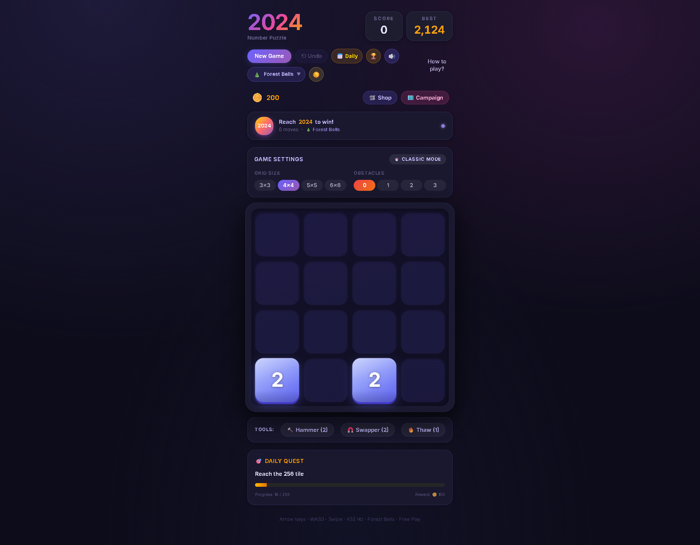
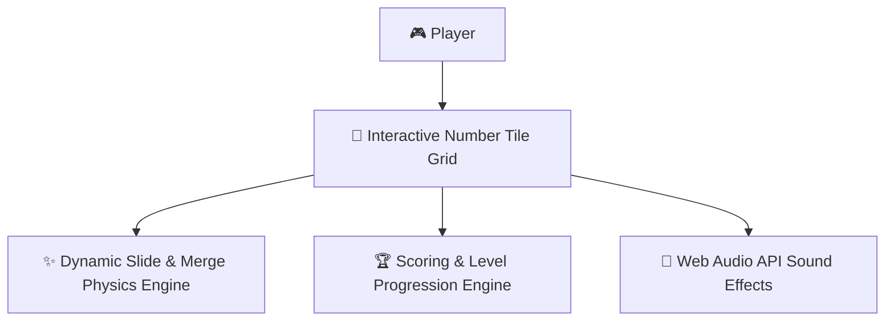

# 🎮 Color Puzzle 2024 (2024 Tile Game)

[](https://opensource.org/licenses/MIT)
[](https://reactjs.org/)
[](https://vitejs.dev/)
[](https://www.typescriptlang.org/)
[](https://tailwindcss.com/)

A modern, feature-rich, vibrant, and interactive web-based 2048-style puzzle game built with **React**, **TypeScript**, **Vite**, and **Tailwind CSS v4**.

---

## 📸 Preview



---

## 🌟 What is this Website?

**Color Puzzle 2024** is an immersive digital web application designed to bring the iconic 2048-style grid puzzle into a sleek, modern aesthetic. Featuring interactive tile animations, customizable grid sizes, obstacle challenges, an interactive RPG-style campaign mode, ambient audio experiences synthesized via the Web Audio API, daily quests, and dynamic themes, it turns classic tile-merging into an engaging gaming experience accessible from any browser.

---

## 🎯 What is the Use of this Website?

This website provides:
* 🧠 **Brain Training & Mental Stimulation:** Enhances logical thinking, spatial awareness, sequential planning, and strategic foresight.
* 🧘 **Stress Relief & Relaxation:** Features soothing 432 Hz tuned ambient music tracks, pleasant audio effects, visual confetti celebrations, and a dark/light mode toggle.
* 🏆 **Competitive Fun:** Track your best scores, compete on top-5 local leaderboards, complete daily challenges, and earn coins to purchase power-ups.

---

## 🕹️ What is this Game?

**Color Puzzle 2024** is a grid-based sliding number puzzle.
* The primary target is to merge matching number tiles until you construct the prized **2024 Tile**!
* Combining two tiles with identical values creates a single tile with **double the value** (e.g., $2 + 2 = 4$, $4 + 4 = 8$, ..., $1024 + 1024 = 2024$).
* The game offers classic free-play mode, timed modes, obstacle-filled grids, seeded daily challenges, and a progression-based campaign map!

---

## 🕹️ How a Person Can Use this Website?

Playing **Color Puzzle 2024** is intuitive across all devices (Desktop, Tablet, Mobile):

1. **Slide Tiles:**
   * **Keyboard (Desktop):** Use the `Arrow Keys` ($\uparrow$, $\downarrow$, $\leftarrow$, $\rightarrow$) or `W`, `A`, `S`, `D` keys to slide all tiles on the board.
   * **Touch Gesture (Mobile/Tablet):** Swipe across the board in the desired direction.
2. **Merge Numbers:**
   * When two tiles with the same number touch while sliding, they merge into one with twice the value!
3. **Use Power-Ups:**
   * **Hammer:** Destroy troublesome obstacle tiles or unwanted numbers.
   * **Swapper:** Swap positions of two tiles to create strategic merge opportunities.
   * **Thaw / Freeze Clear:** Unfreeze frozen tiles.
4. **Complete Quests & Campaign Levels:**
   * Progress through handcrafted levels on the Campaign Map.
   * Collect daily rewards by fulfilling daily quest objectives.

---

## 🌐 Website Features & Highlights

| Feature | Description |
| :--- | :--- |
| 🎛️ **Multiple Game Modes** | Choose between **Classic Free Play**, **Daily Challenge**, **Time Attack**, and **Campaign Map**. |
| 📐 **Customizable Grids & Obstacles** | Play on $3 \times 3$, $4 \times 4$, $5 \times 5$, or $6 \times 6$ grids with optional obstacle obstacles for added difficulty. |
| 🗺️ **RPG Campaign Map** | Unlock sequential levels, earn coins, and complete unique level goals. |
| 🛍️ **In-Game Shop & Power-ups** | Earn coins during gameplay or quests to buy Hammers, Swappers, and Undos. |
| 🎵 **432 Hz Ambient Audio** | Includes 4 synthesized ambient background tracks tuned to 432 Hz and custom audio effects (synthesized via Web Audio API). |
| 🏆 **Leaderboard & Local Storage** | Automatically keeps track of high scores, move counts, and level completions locally. |
| 📅 **Daily Seeded Challenge** | A unique, synchronized board generated each day for players around the world. |
| 🎨 **Dynamic Dark / Light Themes** | Toggle between a vibrant dark glassmorphism mode and a clean light theme. |
| 🎉 **Victory Celebrations & Haptics** | Enjoy confetti animations on milestone achievements along with mobile vibration feedback. |

---

## ⚙️ How to Install & Run Locally

Follow these quick steps to get the app running on your machine:

### 1. Prerequisites
Make sure you have installed:
* [Node.js](https://nodejs.org/) (v18.0.0 or higher)
* `npm` or `pnpm`

### 2. Clone the Repository
```bash
git clone https://github.com/YOUR_USERNAME/color-puzzle-2024.git
cd color-puzzle-2024
```

### 3. Install Dependencies
```bash
npm install
# or if using pnpm
pnpm install
```

### 4. Run the Development Server
```bash
npm run dev
# or
pnpm run dev
```

### 5. Open in Browser
Visit **`http://localhost:5173/`** in your browser to start playing!

---

## 🏗️ Tech Stack

* **Frontend Framework:** [React 18](https://reactjs.org/)
* **Language:** [TypeScript](https://www.typescriptlang.org/)
* **Build Tool:** [Vite](https://vitejs.dev/)
* **Styling:** [Tailwind CSS v4](https://tailwindcss.com/)
* **Icons & UI:** [Lucide React](https://lucide.dev/), Radix UI Primitives, Framer Motion
* **Audio:** Web Audio API (100% synthesized sound effects & ambient music)

---

## 📄 License

This project is licensed under the [MIT License](LICENSE).

---

---

## 🏛️ System Architecture



---

## 💖 Thank You for Visiting & Exploring 🎮 Color Puzzle 2024 (2024 Tile Game)!

> *"Thank you for taking the time to explore this project! Continuous learning, clean craftsmanship, and solving real-world challenges through elegant software are at the core of my developer journey."* 🚀

* 🌟 **Enjoyed this project?** If you found this repository interesting or helpful, please consider giving it a **Star**!
* 📬 **Let's Connect & Collaborate:** I am actively seeking engineering opportunities, impactful internships, and open-source collaborations. Feel free to connect via [GitHub](https://github.com/SriniwasAwasthi) or [Email](mailto:sriawasthi164@gmail.com)
  * 🌐 **LinkedIn:** [https://www.linkedin.com/in/sriniwas-awasthi/](https://www.linkedin.com/in/sriniwas-awasthi/).

---
<div align="center">
  <sub>Designed & Crafted with Passion by <a href="https://github.com/SriniwasAwasthi"><strong>Sriniwas Awasthi</strong></a> • Continuous Learner & Software Engineer</sub>
</div>
